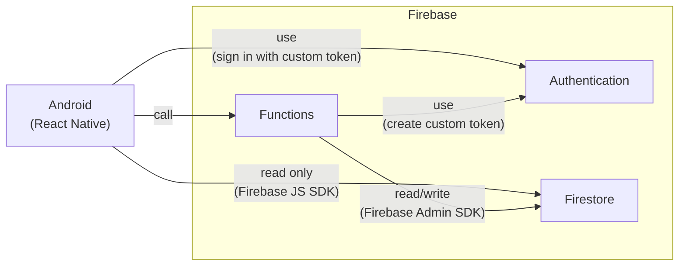
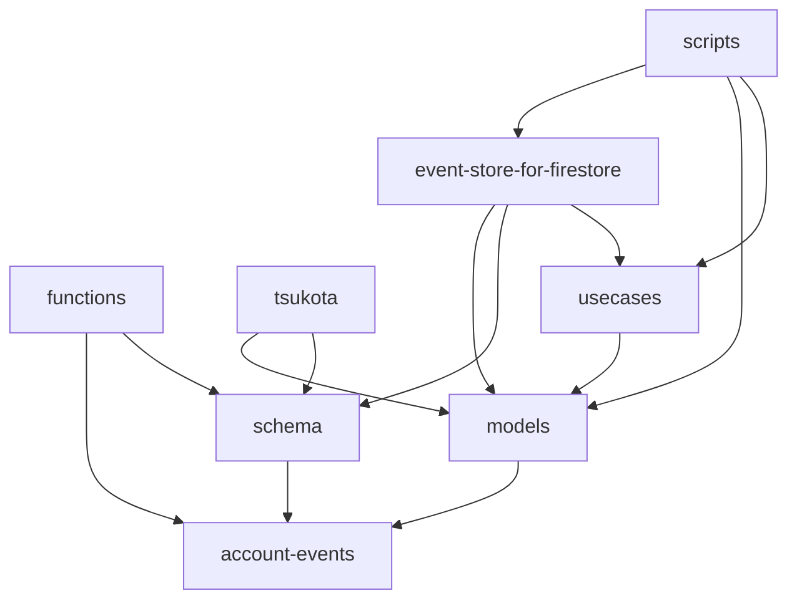
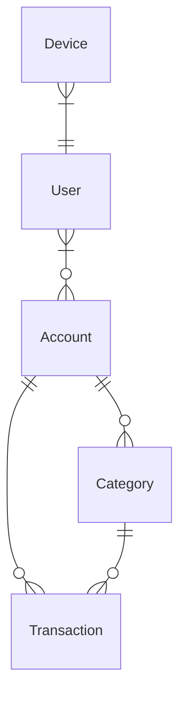

# tsukota

tsukota は使った金額を記録する Android アプリです。

## 機能

- アカウント (Account) の作成・更新・削除
- 分類 (Category) の作成・更新・削除
- 使用額 (Transaction) の作成・更新・削除
- 所有者 (Owner) の追加・削除

## インストール方法

<https://play.google.com/store/apps/details?id=net.bouzuya.lab.tsukota>

## 実行方法

```console
$ # 環境変数の更新
$ cp packages/functions/_env packages/functions/.env
$ vi packages/functions/.env
$ cp packages/tsukota/_env packages/tsukota/.env
$ vi packages/tsukota/.env

$ # VS Code "Dev Containers: Reopen in Container"
$ cd /home/node/packages/functions
$ npm run build
$ cd /home/node/packages/tsukota
$ npm start
```

`compose.yaml` に指定されている通り Firebase Emulator が実行されます。

## システム構成図



## npm パッケージの依存関係



See: [006].

- tsukota …… Android (React Native)
- functions …… Cloud Functions for Firebase

[006]: ./docs/note/006.md

## 永続化先

- Android (React Native)
  - [npm:@react-native-async-storage/async-storage]
    - 実装
      - SQLite
      - `android.database.sqlite.SQLiteOpenHelper`
      - <https://developer.android.com/reference/android/database/sqlite/SQLiteOpenHelper>
      - <https://developer.android.com/training/data-storage/sqlite?hl=ja>
    - DeviceCredential
      - `device` key: `DeviceCredential`
    - Persistene (Firebase Authentication)
      - `__sak` key: `number`
      - `firebase:authUser:${API_KEY}:${appName}` key: JSON
      - (unknown) key: (unknown)
  - [npm:expo-file-system] の documentDirectory
    - 実装
      - <https://developer.android.com/reference/android/content/Context#getFilesDir()>
      - <https://developer.android.com/training/data-storage> の App-specific files の getFilesDir()
    - AccountEvent
      - `${documentDirectory}tsukota-account-events/${accountId}.json` に AccountEvent のローカルキャッシュを `AccountEvent[]` の JSON 表現で保存
- Firestore
  - See: [`packages/functions/src/schema/index.ts`](packages/functions/src/schema/index.ts)
  - See: [`packages/firebase/filestore.rules`](packages/firebase/filestore.rules)
  - `/accounts/${account_id}` (query)
  - `/accounts/${account_id}/events/${event_id}` (query)
  - `/aggregates/account/event_streams/${event_stream_id}`
  - `/aggregates/account/event_streams/${event_stream_id}/events/${event_id}`
  - `/deleted_users/${user_id}`
  - `/devices/${device_id}`
  - `/system/status` (query)
  - `/users/${user_id}` (command & query)
- Authentication
  - uid

## Models



[npm:@react-native-async-storage/async-storage]: https://www.npmjs.com/package/@react-native-async-storage/async-storage
[npm:expo-file-system]: https://www.npmjs.com/package/expo-file-system
