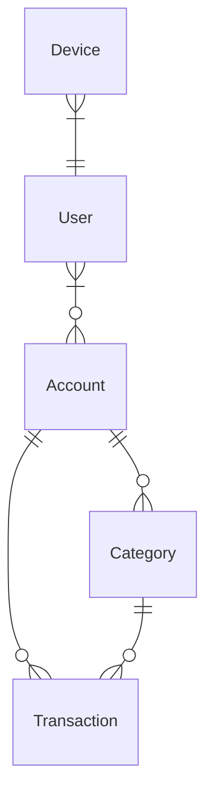

# tsukota

## How to run for debugging

```console
$ # terminal #1
$ # start firebase emulator
$ docker compose up --build

$ # terminal #2
$ # start expo
$ cd packages/tsukota
$ npm start
```

## Models



## Firestore Document Schemas

See also: `firestore.rules`

### `/accounts/{account_id}`

```typescript
type AccountForQuery = {
  deletedAt: string | null;
  id: string;
  name: string;
  owners: string[]; // uid
};
```

### `/accounts/{account_id}/events/{account_event_id}`

See: `./packages/account-events/src/account-events.ts`

```typescript
type AccountEvent = ...
```

### `/aggregates/account/event_streams/{account_event_stream_id}` (private)

```typescript
type AccountEventStream = {
  id: string;
  lastEventId: string;
  owners: string[]; // uid
  protocolVersion: number;
  updatedAt: string;
};
```

### `/aggregates/account/event_streams/{account_event_stream_id}/events/{account_event_id}` (private)

See: `./packages/account-events/src/account-events.ts`

```typescript
type AccountEvent = ...
```

### `/devices/{device_id}` (private)

```typescript
type Device = {
  encryptedSecret: string;
  id: string;
  uid: string;
};
```

### `/system/status`

```typescript
type SystemStatus = {
  minAppVersion: string | null;
};
```

### `/users/{user_id}`

```typescript
type User = {
  account_ids: string[];
  id: string; // user_id, uid
};
```
