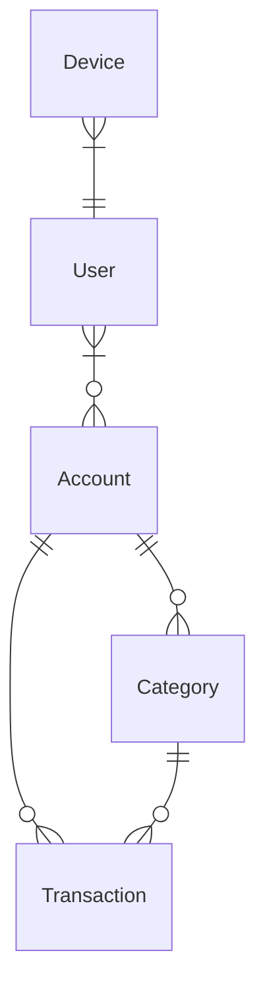

# tsukota

tsukota は使った金額を記録する Android アプリです。

## 機能

- アカウント (Account) の作成・更新・削除
- 分類 (Category) の作成・更新・削除
- 使用額 (Transaction) の作成・更新・削除

## インストール方法

<https://play.google.com/store/apps/details?id=net.bouzuya.lab.tsukota>

## How to run for debugging

```console
$ # terminal #1
$ # start firebase emulator
$ docker compose up --build

$ # terminal #2
$ # start expo
$ cd packages/tsukota
$ npm start
```

## Models


