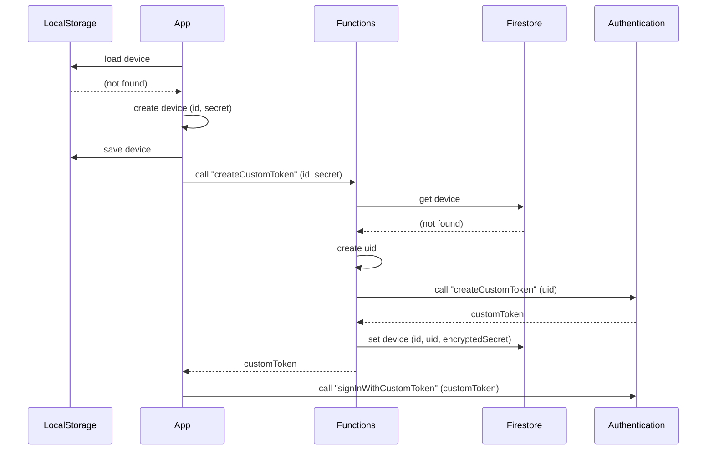
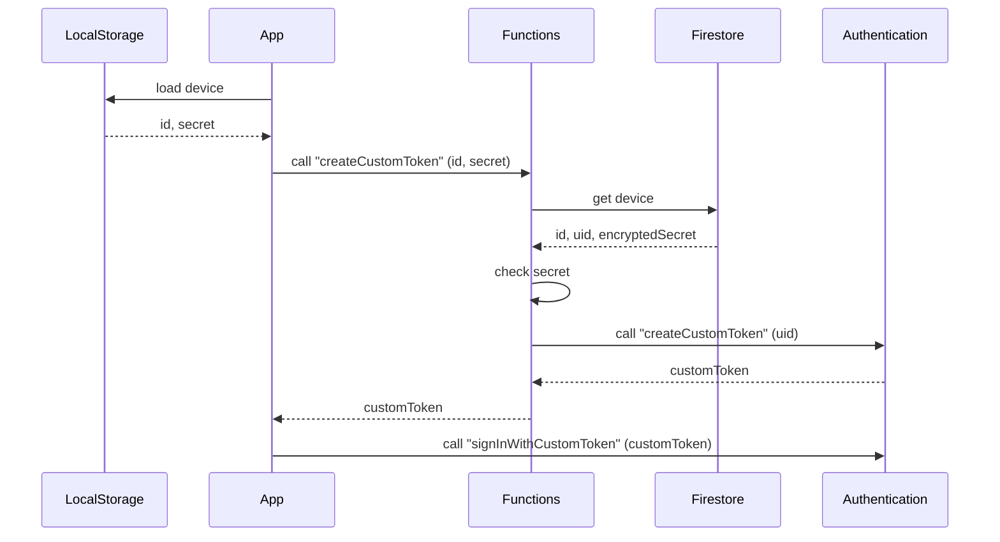

# tsukota

tsukota は使った金額を記録する Android アプリです。

## 機能

- アカウント (Account) の作成・更新・削除
- 分類 (Category) の作成・更新・削除
- 使用額 (Transaction) の作成・更新・削除

## インストール方法

(Google Play ストアからダウンロードできるよう準備中)

## Docker Compose 経由での Firebase Local Emulaator Suite の使用

```console
$ docker compose up --build --detach

$ docker compose exec firebase gcloud auth login --no-launch-browser

$ docker compose exec firebase gcloud projects list

$ # Cloud Firestore から Cloud Storage にエクスポート
$ project_id=...
$ docker compose exec firebase gcloud --project "${project_id}" firestore export "gs://${project_id}.appspot.com"

$ # Cloud Storage からローカル (./storage) にデータをコピー
$ export_prefix='2023-04-09T06:45:39_12320'
$ mkdir storage
$ docker compose exec firebase gsutil -m cp -r "gs://${project_id}.appspot.com/${export_prefix}" storage

$ # コピーしたデータを使った Firebase Local Emulator を起動
$ docker compose exec firebase firebase --project "${project_id}" emulators:start --export-on-exit --import "storage/${export_prefix}"
# View Emulator UI at http://localhost:4000/
```

## メモ

### SignUp



### SignIn



### AccountEvent を public (client-side へ公開) にする or しない

- 直感: public にしたことはないが、しても問題なさそう
- 既存の AccountEvent の構造は変更不可になる
- イベントへの属性の追加は Option なら可能？
  - できない。無視するとまずいものもありそう
- 古いバージョンで新しいバージョンのデバイスから追加されたイベントを解釈できない
  - バージョンとは？ (後述)
  - 古いバージョンから新しいバージョンにアップデートを必須にする
    - バージョンアップを強制させる機能が必要になる
    - 未知のイベントのエラーハンドリングでバージョンアップを促す必要がある
- client-side に処理を置くことで負荷を下げられる？
  - 下げられる。差分のイベントのみを送信すれば、更新の都度、イベントをすべて読んで……がなくなる
  - 差分のイベントのみを送信する場合、イベントが妥当かの検証はしない？
    - できない。すると上記メリットは失われる
    - 最低限、イベントストリームのバージョン (最後のイベント ID 等) を調べる程度のことはする
    - 壊れたとしても当該イベントストリームの利用者が困るだけではある
- 結論: AccountEvent を public にする方針で検討してみる

### バージョンとは

- バージョンが同じ
  - → 解釈できるイベントの種類が同じ
  - → イベントの解釈が同じ
- バージョンは混在する？
  - する
  - 避けられない。アップデートの強制はできるが避けられない
- 新しいバージョンは古いバージョンのイベントは読める
  - ……ように実装する (後方互換性を維持する)
- 古いバージョンは新しいバージョンのイベントは読めない
  - 未知のイベントに対してのエラーハンドリングが必要になる
- あるイベントストリームについて、古いバージョンのイベントのあとに新しいバージョンのイベントは OK
- あるイベントストリームについて、新しいバージョンのイベントのあとに古いバージョンのイベントは NG
  - 一度バージョンアップしたら古いバージョンには戻せないようにする
  - すこしでも状況を簡素化するため
- イベントストリームごとのバージョンをどう管理すべきか？ (後述)

### イベントストリームごとのバージョンの管理方法

(TODO)

## (旧) Firebase Local Emulator Suite の使用

<https://firebase.google.com/docs/cli?hl=ja>
<https://firebase.google.com/docs/emulator-suite/install_and_configure?hl=ja>

```console
$ npm install -g firebase-tools
# ...

$ firebase login
# ...

$ firebase projects:list
# ...

$ project_id='bouzuya-lab-tsukota'
$ firebase use "${project_id}"
# ...

$ firebase init emulators
# ...

$ firebase emulators:start
# ...
```

## (旧) Cloud Firestore からのエクスポート

<https://firebase.google.com/docs/firestore/manage-data/export-import?hl=ja>
<https://cloud.google.com/sdk/docs/install-sdk?hl=ja>

```console
$ # install `gcloud` CLI

$ gcloud auth login
# ...

$ project_id='bouzuya-lab-tsukota'
$ gcloud config set project "${project_id}"
# ...

$ gcloud firestore export gs://bouzuya-lab-tsukota.appspot.com
# ...

$ mkdir storage
$ export_prefix='2023-04-08T08:43:12_90016'
$ gsutil -m cp -r "gs://bouzuya-lab-tsukota.appspot.com/${export_prefix}" storage
# ...

$ firebase emulators:start --import "storage/${export_prefix}"
# ...
```
