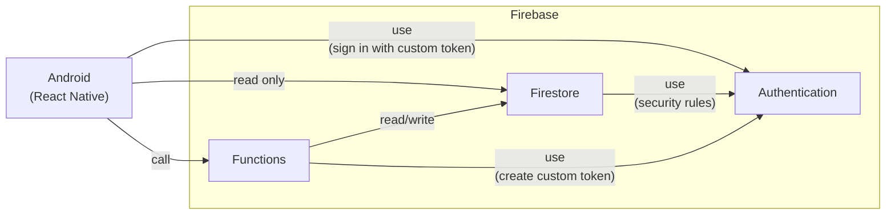

# tsukota

tsukota は使った金額を記録する Android アプリです。

## 機能

- アカウント (Account) の作成・更新・削除
- 分類 (Category) の作成・更新・削除
- 使用額 (Transaction) の作成・更新・削除
- 所有者 (Owner) の追加・削除

## インストール方法

<https://play.google.com/store/apps/details?id=net.bouzuya.lab.tsukota>

## 実行方法

```console
$ # 環境変数の更新
$ cp packages/functions/_env packages/functions/.env
$ vi packages/functions/.env
$ cp packages/tsukota/_env packages/tsukota/.env
$ vi packages/tsukota/.env

$ # VS Code "Dev Containers: Reopen in Container"
$ cd /home/node/packages/functions
$ npm run build
$ cd /home/node/packages/tsukota
$ npm start
```

`compose.yaml` に指定されている通り Firebase Emulator が実行されます。

## システム構成図



## Models


