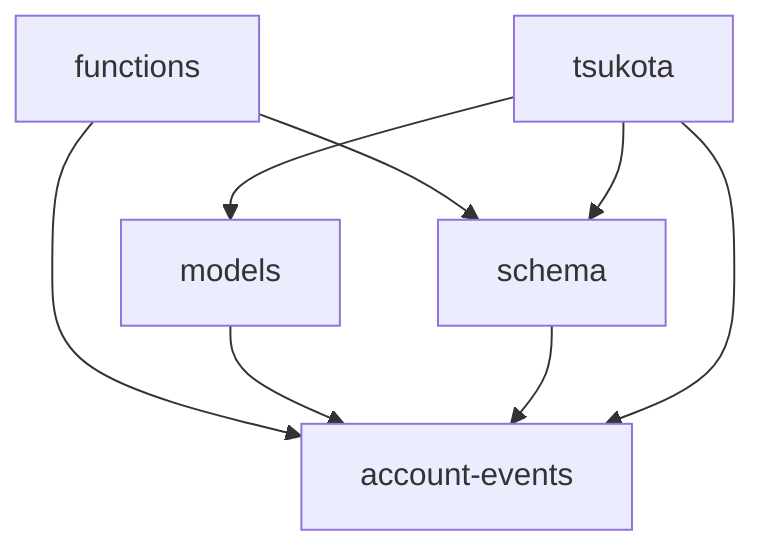
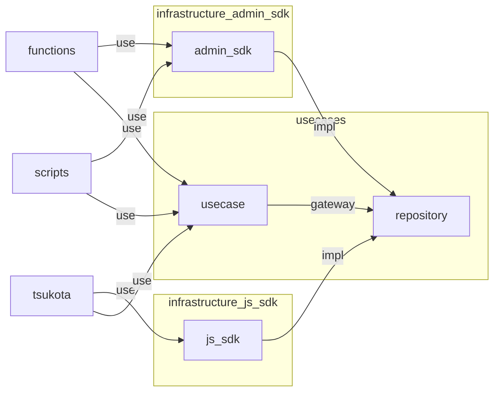

# package 間の依存関係 2023-08-02

- functions が models に依存していないのは意外
- schema 経由や models 経由で account-events に到達できそうなのに直接依存している
- scripts を追加予定だが、 functions と実装の重複が大きい
- Repository のインタフェースが欲しい
- Repository の実装が欲しい (ADMIN SDK & JS SDK (functions call))

- js_sdk については共有していないため tsukota で実装しても良さそう
- admin_sdk については functions と scripts で共有するので別パッケージ化して実装する
- usecase の必要性は怪しいものの repository は usecase の input/output port なのでそこに置きたい repository 単体でくくると二度手間になりそう
