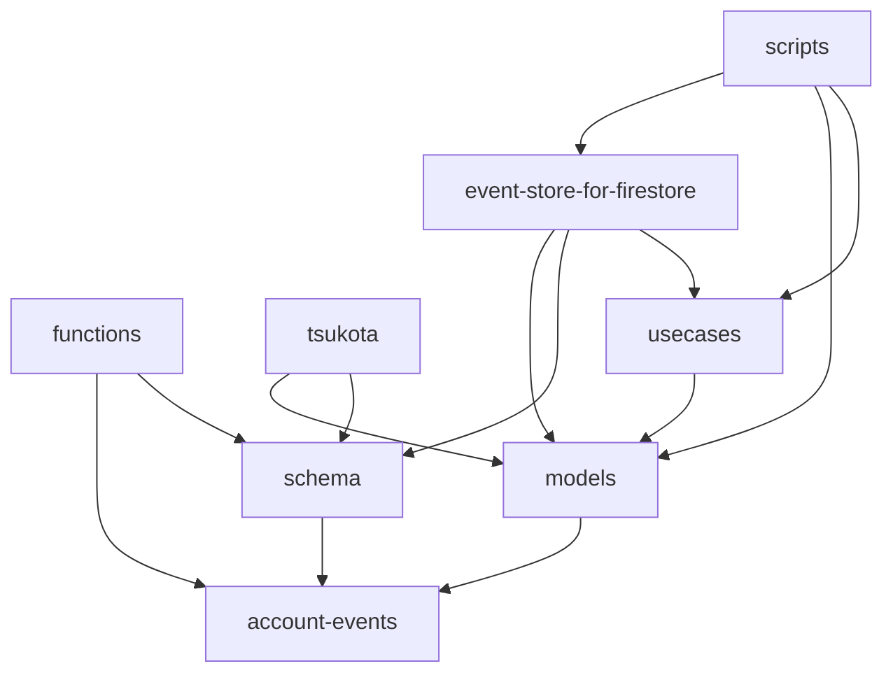
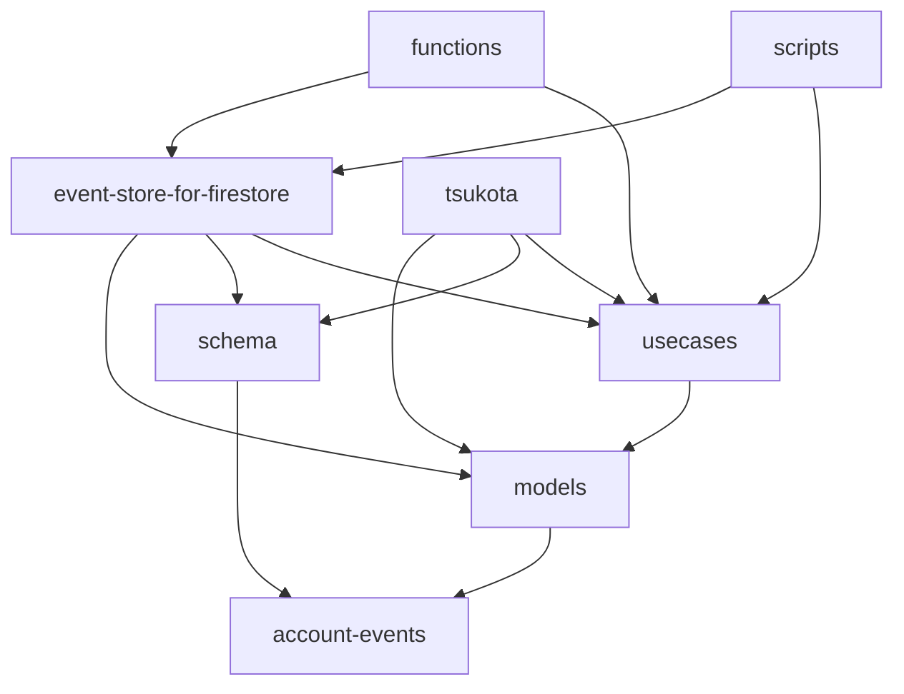

# package 間の依存関係 2023-08-27

## 現状

```mermaid
graph
  account-events
  event-store-for-firestore
  %% firebase
  functions
  models
  %% playstore-assets
  schema
  scripts
  tsukota
  usecases

  event-store-for-firestore --> models
  event-store-for-firestore --> schema
  event-store-for-firestore --> usecases
  functions --> account-events
  functions --> schema
  models --> account-events
  schema --> account-events
  scripts --> event-store-for-firestore
  scripts --> models
  scripts --> usecases
  tsukota --> models
  tsukota --> schema
  usecases --> models
```

## 理想

```mermaid
graph
  account-events
  event-store-for-firestore
  %% firebase
  functions
  models
  %% playstore-assets
  schema
  scripts
  tsukota
  usecases

  event-store-for-firestore --> models
  event-store-for-firestore --> schema
  event-store-for-firestore --> usecases
  functions --> event-store-for-firestore
  functions --> usecases
  models --> account-events
  schema --> account-events
  scripts --> event-store-for-firestore
  scripts --> usecases
  tsukota --> models
  tsukota --> schema
  tsukota --> usecases
  usecases --> models
```
