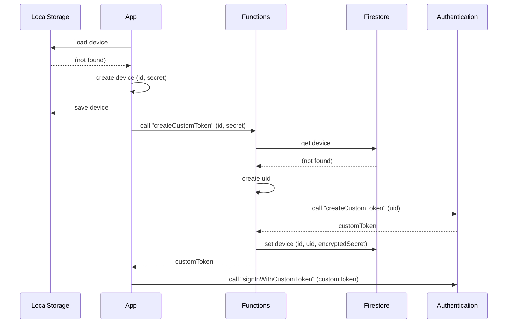
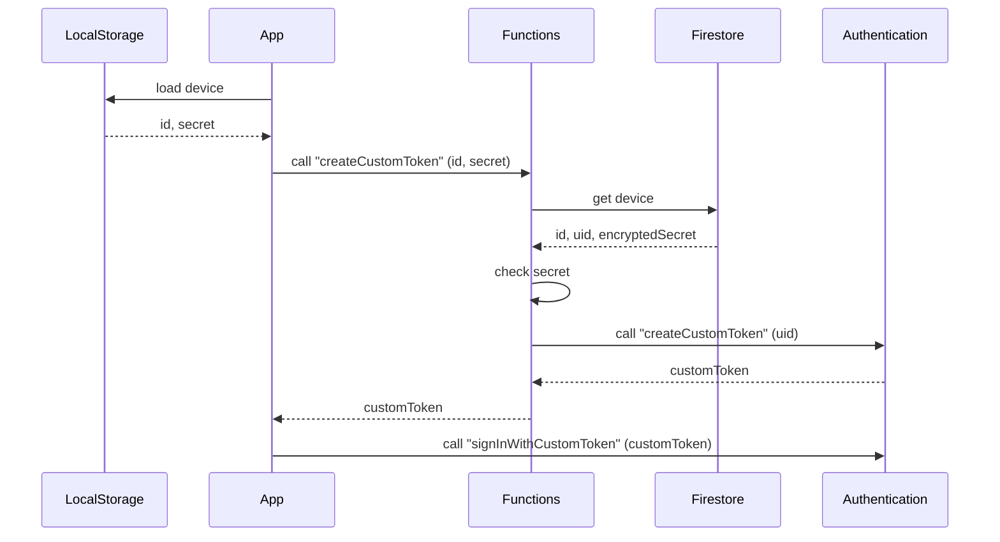

# tsukota

## Docker Compose 経由での Firebase Local Emulaator Suite の使用

```console
$ docker compose up --build --detach

$ docker compose exec firebase gcloud auth login --no-launch-browser

$ docker compose exec firebase gcloud projects list

$ # Cloud Firestore から Cloud Storage にエクスポート
$ project_id=...
$ docker compose exec firebase gcloud --project "${project_id}" firestore export "gs://${project_id}.appspot.com"

$ # Cloud Storage からローカル (./storage) にデータをコピー
$ export_prefix='2023-04-09T06:45:39_12320'
$ mkdir storage
$ docker compose exec firebase gsutil -m cp -r "gs://${project_id}.appspot.com/${export_prefix}" storage

$ # コピーしたデータを使った Firebase Local Emulator を起動
$ docker compose exec firebase firebase --project "${project_id}" emulators:start --export-on-exit --import "storage/${export_prefix}"
# View Emulator UI at http://localhost:4000/
```

## メモ

### SignUp



### SignIn



## (旧) Firebase Local Emulator Suite の使用

<https://firebase.google.com/docs/cli?hl=ja>
<https://firebase.google.com/docs/emulator-suite/install_and_configure?hl=ja>

```console
$ npm install -g firebase-tools
# ...

$ firebase login
# ...

$ firebase projects:list
# ...

$ project_id='bouzuya-lab-tsukota'
$ firebase use "${project_id}"
# ...

$ firebase init emulators
# ...

$ firebase emulators:start
# ...
```

## (旧) Cloud Firestore からのエクスポート

<https://firebase.google.com/docs/firestore/manage-data/export-import?hl=ja>
<https://cloud.google.com/sdk/docs/install-sdk?hl=ja>

```console
$ # install `gcloud` CLI

$ gcloud auth login
# ...

$ project_id='bouzuya-lab-tsukota'
$ gcloud config set project "${project_id}"
# ...

$ gcloud firestore export gs://bouzuya-lab-tsukota.appspot.com
# ...

$ mkdir storage
$ export_prefix='2023-04-08T08:43:12_90016'
$ gsutil -m cp -r "gs://bouzuya-lab-tsukota.appspot.com/${export_prefix}" storage
# ...

$ firebase emulators:start --import "storage/${export_prefix}"
# ...
```
